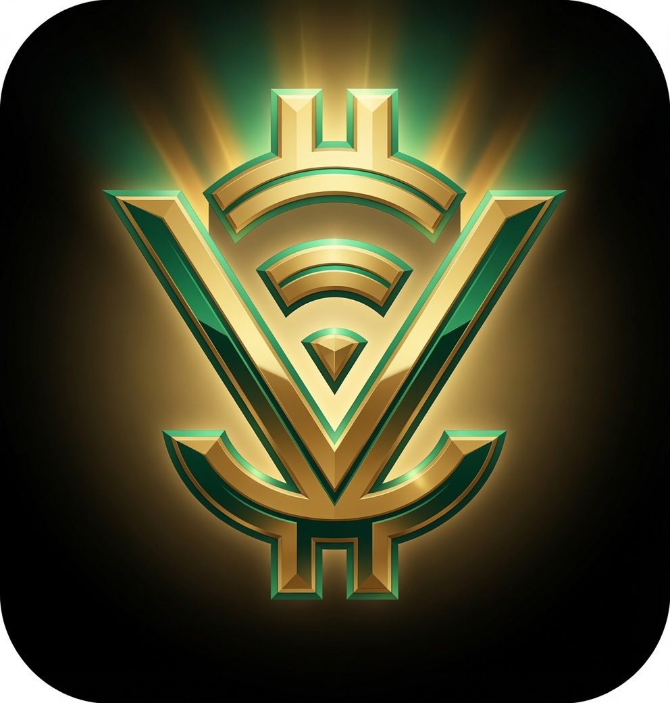

# VitaCoin Core Ecosystem



**Turning Everyday Living Expenses into Generational Wealth on Solana**

VitaCoin is a revolutionary utility ecosystem built on the high-performance Solana blockchain. It transforms mandatory daily living expenses into long-term financial security, homeownership opportunities, and generational wealth. By bridging legacy banking data via Plaid with secure, non-custodial Anchor smart vaults on Solana, VitaCoin offers an empirical, self-sustaining alternative to predatory economic frameworks.

**Don't just pay to live your life. Own it!**

---

## Repository Architecture

- **`/whitepaper/`** — Definitive economic, mathematical, and cryptographic foundation.
- **`/docs/`** — Multi-phase product engineering, compliance, and ecosystem roadmap.
- **`/programs/vitacoin/`** — Production-grade Solana/Anchor smart contract suite governing vault locking, rewards distribution, and oracle verifications.
- **`/app/`** — Enterprise React/Next.js dApp with Solana Web3 wallet integration, Plaid synchronization, and interactive dashboards.
- **`/.github/workflows/`** — Automated CI/CD pipeline for code validation, linting, and Anchor testing.

---

## System Dependencies

- **OS**: Linux (Ubuntu 22.04 LTS+) or macOS
- **Rust**: `rustc 1.75.0` or newer
- **Solana CLI**: `solana-cli 1.18.11` or newer
- **Anchor**: `anchor-cli 0.29.0` or newer
- **Node.js**: `v18.18.0` or newer (with yarn/npm)

## Installation & Local Setup

```bash
# 1. Clone the repository
git clone <your-repo-url>
cd vitacoin

# 2. Install dependencies
yarn install
anchor build

# 3. Start local validator & deploy
solana-test-validator &
anchor deploy --provider.cluster localnet
